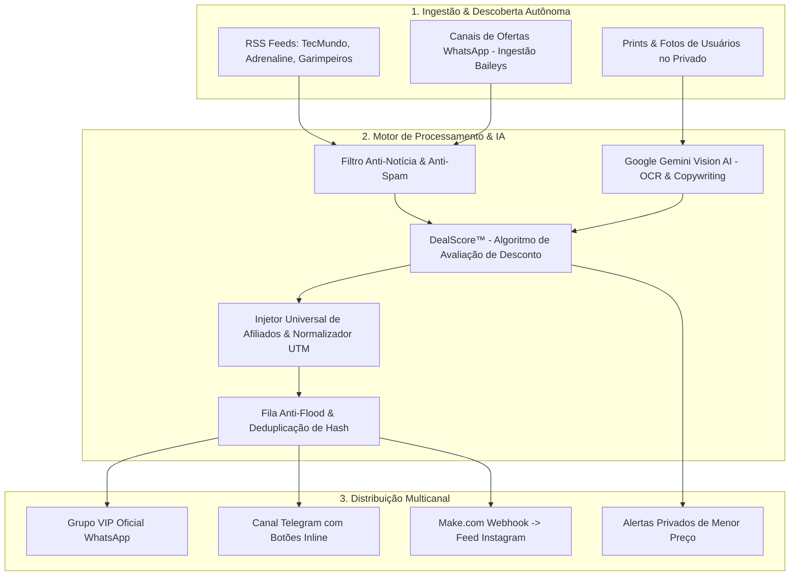

<div align="center">

# ⚡ PreçoSmart Ecosystem (v3.0)
### Plataforma Full-Stack de Inteligência de Ofertas, Visão Computacional & Automação Multicanal de Afiliados

[](https://github.com/twazevedo/precosmart/actions)
[](https://nodejs.org/)
[](https://www.docker.com/)
[](https://github.com/WhiskeySockets/Baileys)
[](https://ai.google.dev/)
[](https://www.mongodb.com/)

<p align="center">
  <b>Um motor autônomo de inteligência de dados que identifica, enriquece, gera copywriting com IA e distribui ofertas de alta conversão em tempo real no WhatsApp, Telegram e Instagram.</b>
</p>

</div>

---

## 🏗️ Arquitetura do Sistema

O ecossistema foi desenhado com foco em **alta disponibilidade**, **baixo consumo de memória (< 120MB)** e **desacoplamento total de canais**:



---

## 💎 Diferenciais de Engenharia

### 1. 👁️ Visão Computacional com Google Gemini (Multimodal)
- Processamento em tempo real de prints enviados pelos usuários no privado ou grupos.
- O modelo identifica o produto, preço antigo e novo, avalia a oportunidade e retorna cotações diretas nas lojas parceiras.

### 2. 🛡️ Sanitizador de Links e Injeção Resiliente de Afiliados
- **Shopee:** Resolução e mapeamento com parâmetros UTM nativos (`utm_source` e `utm_medium`), prevenindo quebras de roteamento e telas de "Campanha Expirada".
- **Mercado Livre:** Tratamento de páginas de criadores (`/social/`) e injeção transparente de `matt_tool`.
- **Amazon & Magalu:** Encurtadores oficiais, vitrine de cupons categorizada e comissões garantidas.

### 3. 📸 Scraper Dinâmico de Imagens de Alta Resolução (Open Graph)
- Captura autônoma da tag `og:image` em links de destino para envio de imagens grandes anexadas no WhatsApp, dispensando templates pesados ou armazenamento estático de terceiros.

### 4. 🗄️ Persistência Híbrida & Auto-Recuperação
- Suporte a MongoDB nativo com fallback automático para camada de persistência local (`db.js`).
- Tratamento de sessão com Baileys Multi-File Auth para reconexões resilientes sem perda de credenciais.

---

## 🚀 Como Executar o Projeto

### Opção 1: Via Docker (Recomendado)
```bash
# 1. Clone o repositório
git clone https://github.com/twazevedo/precosmart.git
cd precosmart

# 2. Configure as variáveis de ambiente
cp whatsapp-bot/.env.example whatsapp-bot/.env

# 3. Suba o container
docker compose up -d

# 4. Acesse o painel e escaneie o QR Code
# http://localhost:3002
```

### Opção 2: Localmente via Node.js
```bash
cd whatsapp-bot
npm install
npm test
npm start
```

---

## 🧪 Testes Automatizados (CI/CD)

A suíte de testes cobre todas as regras de negócio críticas:
```bash
npm test
```
- [x] Filtro Anti-Conversa & Anti-Notícia
- [x] Extração de SKU, ASIN e MLB
- [x] Cálculo do Algoritmo DealScore™
- [x] Encurtador de Links e Analytics de Cliques
- [x] Expansão Multicanal Telegram com botões inline
- [x] Parsers de RSS do Crawler

---

## 📄 Licença
Distribuído sob licença MIT. Desenvolvido para alta conversão e automação no e-commerce brasileiro.
